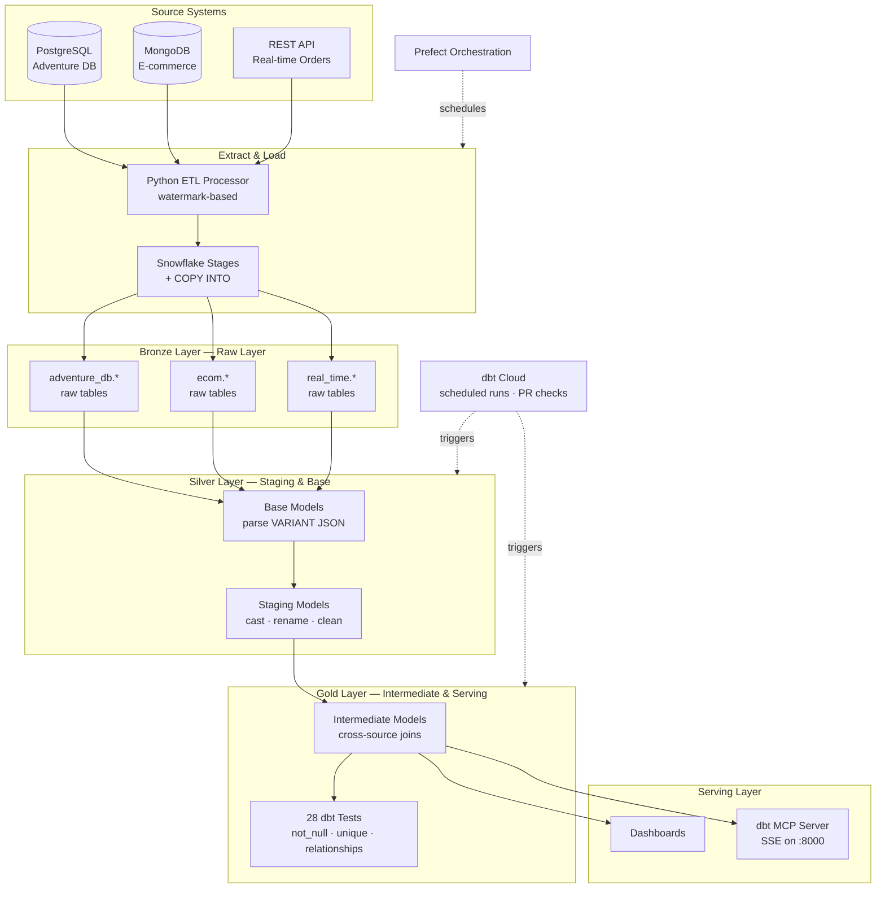

# Adventure Works Data Platform

> This project builds a production ready data pipeline on Snowflake and dbt that ingests Adventure Works sales, e-commerce, and real-time order data into a single warehouse, enabling reporting and agent accessible analytics via MCP.


## Architecture



**Caption:** Raw data from three source systems (PostgreSQL, MongoDB, REST API) is extracted by a watermark-based Python ETL processor and landed in Snowflake's Bronze layer. dbt transforms it through Silver (base parsing, staging cleanup) into Gold (cross-source intermediate models with 28 automated tests), serving dashboards and an AI-accessible MCP server. Prefect orchestrates ingestion; dbt Cloud handles scheduled runs and CI/CD.

---

## Problem Statement

Adventure Works generates sales data across three disconnected systems: a legacy PostgreSQL database, a MongoDB e-commerce store, and a real-time order REST API. Without a unified pipeline, answering questions like "which marketing campaigns drove the most revenue?" requires manual multi-system queries that are slow, error-prone, and inaccessible to non-technical stakeholders. This platform solves that by ingesting all three sources into a Snowflake data warehouse and exposing the cleaned data through both dashboards and an AI-accessible MCP server, enabling anyone in the organization to query the warehouse in plain English.

---

## Tech Stack

| Layer | Technology | Why |
|-------|-----------|-----|
| Source Systems | PostgreSQL, MongoDB, REST API | These technologies are the most common data sources that a Data Engineer will find in the real world. I used these to best simulate an organization's environment.  |
| Extraction | Python ETL Processor | I built a custom Python ETL processor that uses watermarks to track the last extracted record from PostgreSQL and MongoDB, so only new data moves each cycle. This keeps source system load low and makes the pipeline efficient enough to run on a schedule without full refreshes. |
| Warehouse | Snowflake | Snowflake allows for a separation of compute and storage that fits my use case of occasional data processing. Snowflake also has native dbt integration that allows for easy data manipulation in a modern cloud platform.  |
| Transformation | dbt | I am using dbt to enable data quality through native testing. It also is easy to document for future users. Additionally, while developing the warehouse I used version control to make changes and guarantee my data was moving through the warehouse correctly. Finally, the ability to trace data lineage easily with dbt makes it an obvious choice because data becomes more reproducible and less of a blackbox when you can see where a dashboard is pulling its data from. |
| Orchestration | Prefect | I chose Prefect as my orchestrator because it easily allows for rerunning interrupted jobs and is a low complexity environment that beginning engineers can quickly learn and navigate to allow for minimal startup time.  |
| CI/CD | dbt Cloud + GitHub | I used these for version control and automated warehouse builds while the pipeline is live. This allows for near instant updates as code is pushed. Implementing dbt Cloud also prevents code changes from affecting the production environment if tests are failing, adding a layer of protection to the warehouse. |
| Agent Access | dbt MCP Server | The MCP server prepares the data to be seen by AI agents for easy querying, lineage understanding, asking for downstream effects of warehouse changes, and helping new engineers quickly become familiar with complex pipelines. MCP servers also require deep documentation, pushing data warehouses to be more accessible.  |
| Containerization | Docker Compose | This pipeline does not run solely on my machine. Docker containers enable reproducibility of this pipeline onto any infrastructure so it can be migrated, agnostic to an organization's preferred system. |

---

## Data Flow


**Ingestion:** 

I pull data from the MongoDB and PostgreSQL databases using a timestamp watermark that makes the system more efficient and clean by not pulling all records each time, just the new records each cycle. I pull the REST API data on a configured schedule. All three sources stage into Snowflake via a COPY INTO and then land into the raw layer. I used Prefect to orchestrate scheduling and to rerun the work if it is interrupted. 

Future work that I could do would be to use an AWS Lambda/Azure Function to pull the REST API data each time that the count of records to pull reach a threshold for working at peak hours to prevent backlogs.

**Transformation:**  

For the MongoDB data that comes in as JSON VARIANT type, I used base models to turn that data into standard columns that I can later clean. I then used staging models to clean, cast, and rename the data to get it into a standard format. An example of this is the stg_real_time__chat_logs model that casts the data from parsed JSON columns into the appropriate data types and renames columns to match other staging models that it will later be joined on. I finally added the intermediate models to join data together (to pre-aggregate data to make future consumption easier) and enriched the data to get customer business case columns prepared at a lower latency and compute cost than recreating it on dashboards later in the pipeline. An example of this is the int_web_analytics_with_customers model that connects the web sessions (found in the stg_web_analytics model) to the customers (from the stg_adventure_db__customers model).

**Serving:** 

Before the data is finally consumed, I wrote dbt tests to make sure that the join relationships between the different models were correct, test to make sure that there are no null values in appropriate columns (such as product_id), unique values where they should be unique (like with customer_id), and other custom business logic tests like checking for negative inventory and freshness checks in the data. Those tests were automated with dbt Cloud that runs on a schedule and with each PR. I created a dashboard with Snowsight (Snowflake's dashboard platform) that lets stakeholders see into data insights coming in from the pipeline. Finally, I created a MCP that exposes the data models to AI agents for lineage exploration and natural language querying. 


---

## Setup and Run

### Prerequisites
- Docker Desktop
- Snowflake account (trial works)
- Python 3.9+
- dbt Cloud account (free tier)

### Quick Start

```bash
# 1. Clone the repository
git clone https://github.com/JonasButikofer/end-to-end-data-engineering.git
cd end-to-end-data-engineering

# 2. Configure environment
cp .env.sample .env
# Edit .env with your Snowflake credentials

# 3. Create the Snowflake raw layer
# Log into Snowflake and run the SQL in snowflake/setup.sql to create the
# database, schemas (RAW_EXT, ADVENTURE_DB, ECOM, REAL_TIME, WEB_ANALYTICS),
# warehouse, role, and stages. The ETL processor then handles COPY INTO on first run.

# 4. Start all services
docker compose up -d

# 5. Run dbt models and tests
cd dbt
dbt build

# 6. Start the MCP server
cd dbt
$env:MCP_TRANSPORT="sse"; $env:DBT_PROJECT_DIR="."; $env:DBT_PROFILES_DIR="."; uvx dbt-mcp
# Server runs at http://localhost:8000/sse — leave this terminal open

# 7. (Optional) Run the MCP demo
cd mcp
uv sync
uv run python demo_client.py
```

### Environment Variables

Copy `.env.sample` to `.env.dev` (local) and `.env.docker` (Docker services) and fill in your credentials. See `.env.sample` for the full variable list.

---

## Project Milestones

### Milestone 1: Core Pipeline

I built the foundational extraction and transformation pipeline connecting all three source systems. The Python ETL processor pulls from PostgreSQL and MongoDB using watermarks, and stages REST API order data into Snowflake. I created 11 staging models across three source schemas (`adventure_db`, `ecom`, `real_time`), 4 base models to parse MongoDB and API JSON VARIANT data, and 3 intermediate models (`int_sales_orders_with_campaign`, `int_sales_order_with_customers`, `int_sales_order_line_items`) that join data across sources. I also implemented the initial suite of dbt tests covering nullability, uniqueness, and relationship integrity.

### Milestone 2: Orchestration, Quality, and Agent-Assisted Development

I added Prefect to orchestrate the pipeline on a schedule and handle retries automatically. I integrated dbt Cloud to run scheduled builds and block deploys when tests fail. I also built out the web analytics pipeline, adding `stg_web_analytics` and `int_web_analytics_with_customers` to tie session data to known customers. Source freshness checks were added to alert on stale data, and I created a Snowsight dashboard for stakeholder visibility.

### Milestone 3: Agent Access and Portfolio

I deployed a dbt MCP server that exposes all 18 models to AI agents, enabling natural language querying and lineage exploration without needing to know SQL. I upgraded model and column documentation across the project to be agent-friendly — explicitly documenting join keys, filters, and enum values that agents need to reason about the data correctly. I also built and ran a Python demo client that walks through the full MCP tool set end to end.

---

## Key Metrics

<!-- Run actual Snowflake queries to fill in these numbers. Do NOT estimate or guess. -->

| Metric | Value |
|--------|-------|
| Raw records processed per cycle | 44974 |
| Pipeline execution time | 37.58 seconds |
| dbt models | 18 |
| dbt tests | 28 |
| Test pass rate | 100% |
| Data sources integrated | 3 |
| Source tables | 13 |
| Models exposed via MCP | 18 |
| Source freshness SLA | 24 hours |

---

## What I Learned

This was a massive undertaking that took me several weeks to engineer. There were so many complex parts that I did not understand and had to pause for hours at a time to fully understand — such as fully understanding the progression from base --> staging --> intermediate. I had to learn several new tools to get everything working from Snowflake to Prefect to dbt. I was genuinely amazed at the performance of my AI agent once I attached it to my MCP; I was able to trace model changes and follow all of my work that I spent weeks building. As a Data Engineer I learned that context and documentation are more important than the technology; I can easily learn a new technology, but not being able to easily navigate what I have previously built and know how it affects the warehouse as a whole is what would prevent me from actually having an impact.

---

## Future Improvements

- **Role-Based MCP Access Controls**: Right now the MCP server exposes all models to anyone who can reach it. In a real organization I would implement role-based access so that a marketing manager can query campaign data but cannot see financial or PII columns that are restricted to analysts and engineers. This would also include audit logging so every query is traceable back to a user.
- **Threshold-Based Ingestion via Cloud Functions**: The current watermark-based processor runs on a fixed schedule. I would replace the fixed interval with an AWS Lambda or Azure Function that triggers ingestion when the count of unprocessed records crosses a threshold — keeping latency low at peak hours without wasting compute during quiet periods.
- **Snowflake-Native MCP**: The dbt MCP server is limited to manifest-based metadata tools when the Snowflake warehouse is suspended, because the `show` tool requires live compute to execute queries. Replacing it with a Snowflake-native MCP would allow the agent to run SQL directly against the warehouse with full control over compute, removing that dependency and making live querying reliable.

---

## Technical Decisions

See [technical_decisions.md](technical_decisions.md) for detailed documentation of key architectural choices.
